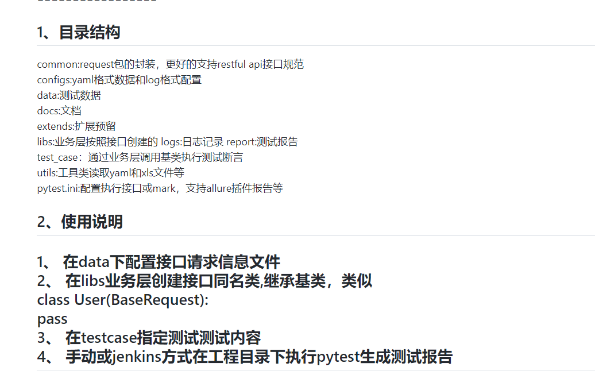

python版的接口自动化框架介绍 
================= 

1、目录结构
-----------

common:request包的封装，更好的支持restful api接口规范 
configs:yaml格式数据和log格式配置 
data:测试数据 
docs:文档 
extends:扩展预留 
libs:业务层按照接口创建的
logs:日志记录
report:测试报告 
test_case：通过业务层调用基类执行测试断言 
utils:工具类读取yaml和xls文件等 
pytest.ini:配置执行接口或mark，支持allure插件报告等

2、使用说明
-----------
1、 在data下配置接口请求信息文件 
2、 在libs业务层创建接口同名类,继承基类，类似 
    class User(BaseRequest): 
        pass 
3、 在testcase指定测试测试内容 
4、 手动或jenkins方式在工程目录下执行pytest生成测试报告
-----------

运行之后结果报告 

3、作者信息
-----------
author:alvin 
qq    :6449694 
wx    :kings_qa 
